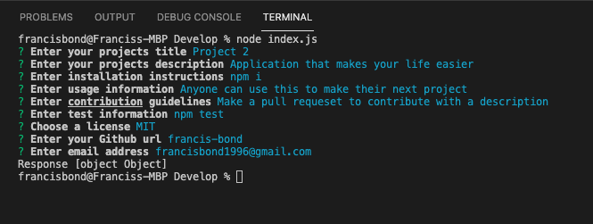
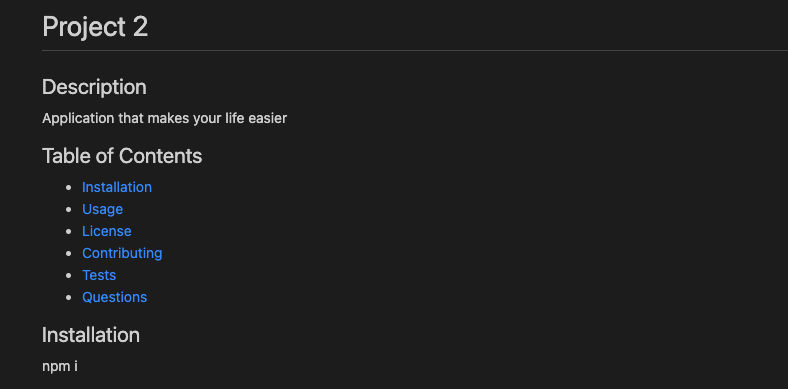

# README generator

Title: README generator

Developer: Francis Bond

Deployment Date: Jan 25, 2022

For: UT Coding Bootcamp

Published: GitHub 

Built with: Javascript, npm fs, npm inquirer

## Summary

Application is initiated by using node index.js in the integrated terminal.

User is then prompted for information to include in the read me.

Once all information is input, a custom readme is created.

## Development

Read me generator is a simple application that uses inquirer to get inputs in the terminal and uses writeFile to create our file. 

The biggest challenge in this development was keeping track of the flow of objects. Using 2 javascript files to complete this homework.